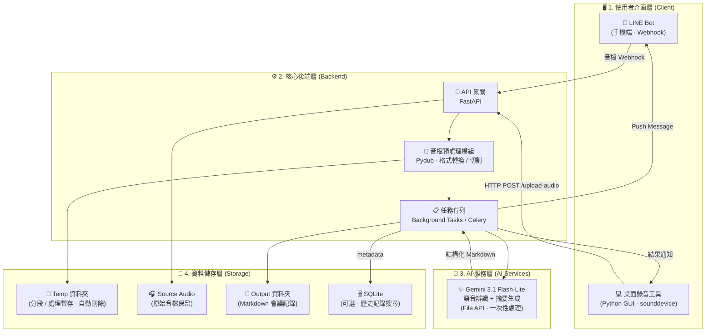
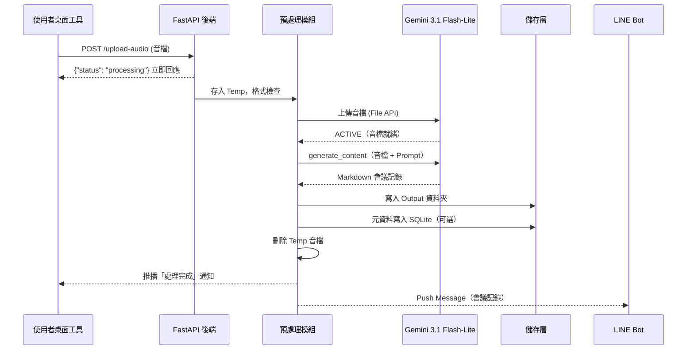

# 🎙️ AI 語音會議助理 — 完整系統架構文件 v2.0

> **文件版本**：2.0.0
> **更新日期**：2026/07/05
> **現況**：MVP v1.0（單檔處理腳本）已驗證完成，本文件定義完整產品架構的擴展路徑。

---

## 一、系統架構圖 (System Layers)



---

## 二、層級說明總覽

| 層級名稱 | 負責模組與技術堆疊 | 主要任務 |
| --- | --- | --- |
| **1. 使用者介面層 (Client)** | 手機端：LINE Bot (Webhook)<br>電腦端：Python GUI (Tkinter/PyQt) + `sounddevice` | 收集音訊來源（實體錄音 / 線上擷取），並向後端發送請求，最後展示結果給使用者。 |
| **2. 核心後端層 (Backend)** | 框架：Python + FastAPI<br>非同步處理：Celery 或 Background Tasks | 系統中樞。接收音檔、進行格式檢查、排程處理、呼叫 AI API，並將結果回傳給介面層。 |
| **3. AI 服務層 (AI Services)** | Gemini 3.1 Flash-Lite API（語音辨識 + 摘要生成一體化） | 執行高耗能的機器學習運算，將語音直接轉換為結構化會議記錄。 |
| **4. 資料儲存層 (Storage)** | 檔案系統：本地資料夾（暫存區 / 封存區）<br>資料庫：SQLite（輕量級，可選） | 暫存處理中的音檔，並永久保存轉錄好的 Markdown 文件與會議元資料。 |

---

## 三、各模組功能詳細拆解

### 1. 使用者介面層 (Client)

針對 50% 實體、50% 線上的需求，設計兩個輕量級入口：

#### 📱 實體會議入口 (LINE Bot)
- **情境**：在外開會，手機直接錄音。
- **功能**：使用者將 `.m4a` 或 `.mp3` 傳送到指定的 LINE 官方帳號。
- **運作**：LINE Server 觸發 Webhook 送到後端，處理完後 Bot 直接 Push Message 完整會議記錄。

#### 💻 線上會議入口 (桌面錄音小工具)
- **情境**：在電腦前開 Google Meet、Teams 或 Zoom。
- **功能**：極簡視窗，只有「錄音 / 停止」按鈕。
- **運作**：透過 `sounddevice` 或 `pyaudio`，**同時擷取系統喇叭（別人說話）與麥克風（自己說話）**，混音存成本地 `.mp3` 後，自動打 API 送給後端。

---

### 2. 核心後端層 (Backend)

> 可跑在筆電上，或部署於免費雲端平台（如 Render / Fly.io）。

| 子模組 | 技術 | 功能 |
|--------|------|------|
| **API 網關** | FastAPI | 開出 `/upload-audio`（桌面端上傳）與 `/line-webhook`（LINE 傳遞）端點 |
| **音檔預處理** | Pydub | 格式統一轉換為 `.mp3`；音檔切割（超過 25MB 時切為 15 分鐘小段） |
| **任務佇列** | Background Tasks | 背景非同步執行，讓前端不卡住；進階版可升級至 Celery + Redis |

---

### 3. AI 服務層 (AI Services)

> **架構亮點**：使用 Gemini File API，**一次 API 呼叫即完成語音辨識 + 摘要生成**，相較 Whisper + GPT-4o 雙 API 方案，速度更快、成本更低。

| 方案 | 技術 | 優勢 | 限制 |
|------|------|------|------|
| ⭐ **現行方案（已實作）** | Gemini 3.1 Flash-Lite | 一次 API 完成、費用低、免費層可用 | 單次音訊長度上限 |
| 備選方案 | OpenAI Whisper → GPT-4o | 逐字稿品質高、語言支援廣 | 需兩次 API、成本較高、Whisper 25MB 限制 |

**Output Prompt 四大區塊**：
1. 📋 會議摘要 (Executive Summary) — 300 字以內
2. ✅ 重要決議 (Key Decisions) — 條列式
3. 📌 待辦事項 (Action Items) — 表格（任務、負責人、期限、優先級）
4. 📝 完整逐字稿 (Verbatim Transcript) — 附講者標記與時間戳記

---

### 4. 資料儲存層 (Storage)

保持輕量，按需擴展：

```
meeting_assistant/
├── temp/                          ← 分段與處理暫存檔（自動刪除）
├── output/
│   ├── source_audio/              ← 已上傳的原始音檔（處理後保留）
│   ├── 2026-07-04_Marketing.md   ← 日期命名的會議記錄
│   ├── 2026-07-05_Sync.md
│   └── ...
└── meetings.db                    ← SQLite（可選，歷史搜尋用）
```

**SQLite 資料表設計（現行）**：

| 資料表 | 用途 |
|--------|------|
| `meetings` | 保存會議標題、日期、原始音檔名稱、Markdown 輸出路徑、摘要與建立時間。 |
| `meeting_fts` | SQLite FTS5 虛擬表，索引 `title`、`source_audio`、`summary`、`output_path`，支援比 `LIKE` 更快的全文搜尋。 |
| `jobs` | 持久化音檔處理佇列，保存狀態、payload、attempts、取消旗標與進度欄位。 |
| `job_events` | 任務事件時間線，記錄建立、worker claim、狀態轉換、retry、取消等事件，供維運與 UI 觀察流程。 |

搜尋流程優先查詢 `meeting_fts`；若部署環境的 SQLite 不支援 FTS5，API 會退回 `LIKE` 搜尋 `title`、`summary`、`source_audio` 與 `output_path`。

---

## 四、標準資料流向 (Data Flow)

以**一次線上會議**的完整流程為例：



---

## 五、開發里程碑 (Roadmap)

| 階段 | 功能 | 狀態 |
|------|------|------|
| **Phase 0** | 單檔處理 CLI 腳本（MVP） | ✅ **已完成並驗證** |
| **Phase 1** | FastAPI 後端 + `/upload-audio` 端點 | ✅ **已完成** |
| **Phase 2** | 桌面錄音 GUI（sounddevice + Tkinter） | ✅ **已完成** |
| **Phase 3** | LINE Bot Webhook 整合 | ✅ **已完成** |
| **Phase 4** | SQLite 歷史記錄 + 搜尋功能 | ✅ **已完成** |
| **Phase 5** | 雲端部署（Render / Fly.io） | 🔲 待開發 |

---

## 六、技術選型清單

| 類別 | 套件 / 服務 | 用途 |
|------|------------|------|
| AI 核心 | `google-genai` | Gemini 3.1 Flash-Lite API |
| Web 後端 | `fastapi` + `uvicorn` | API 伺服器 |
| 音訊擷取 | `sounddevice` / `pyaudio` | 麥克風 / 系統聲音擷取 |
| 音訊格式 | `pydub` + `ffmpeg` | 格式轉換、切割 |
| GUI | `tkinter` / `PyQt6` | 桌面錄音視窗 |
| LINE 整合 | `line-bot-sdk` | Webhook + Push Message |
| 資料庫 | `sqlite3`（標準庫，免安裝） | 會議記錄元資料 |
| 環境管理 | `python-dotenv` | API Key 管理 |

---

*AI 語音會議助理 · 系統架構文件 v2.0 · 2026/07/05*
