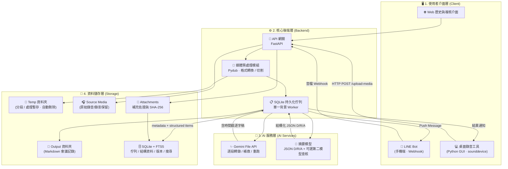
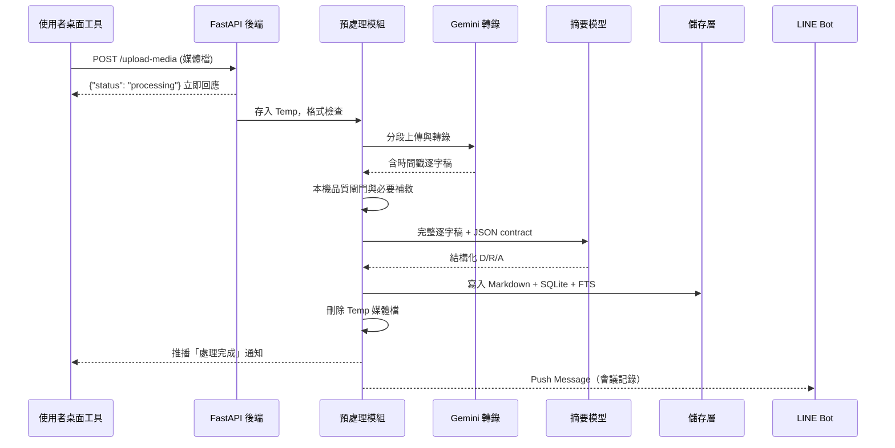

# 🎙️ AI 語音會議助理 — 現行系統架構文件 v2.1

> **文件版本**：2.1.0
> **更新日期**：2026/07/29
> **現況**：FastAPI、SQLite 持久化佇列、Web/LINE/GUI、多段轉錄、品質閘門、人工複核與全文搜尋均為現行功能。

---

## 一、系統架構圖 (System Layers)


```mermaid
graph TB
    subgraph CLIENT["🖥️ 1. 使用者介面層 (Client)"]
        WEB["🌐 Web 歷史與複核介面"]
        LINE["📱 LINE Bot\n(手機端 · Webhook)"]
        GUI["💻 桌面錄音工具\n(Python GUI · sounddevice)"]
    end

    subgraph BACKEND["⚙️ 2. 核心後端層 (Backend)"]
        FASTAPI["🚪 API 網關\nFastAPI"]
        PREPROCESS["🔧 媒體預處理模組\nPydub · 格式轉換 / 切割"]
        QUEUE["📋 SQLite 持久化佇列\n單一背景 Worker"]
    end

    subgraph AI["🤖 3. AI 服務層 (AI Services)"]
        TRANSCRIBE["✨ Gemini File API\n逐段轉錄 / 補救 / 重跑"]
        SUMMARY["🧠 摘要模型\nJSON D/R/A + 可選第二模型查核"]
    end

    subgraph STORAGE["💾 4. 資料儲存層 (Storage)"]
        TEMP["📁 Temp 資料夾\n(分段 / 處理暫存 · 自動刪除)"]
        SOURCE["🎧 Source Media\n(原始錄音/錄影保留)"]
        OUTPUT["📂 Output 資料夾\n(Markdown 會議記錄)"]
        ATTACH["📎 Attachments\n補充佐證與 SHA-256"]
        SQLITE["🗄️ SQLite + FTS5\n佇列 / 結構資料 / 版本 / 搜尋"]
    end

    WEB --> FASTAPI
    LINE -- "音檔 Webhook" --> FASTAPI
    GUI -- "HTTP POST /upload-media" --> FASTAPI
    FASTAPI --> PREPROCESS
    FASTAPI --> SOURCE
    PREPROCESS --> TEMP
    PREPROCESS --> QUEUE
    QUEUE --> TRANSCRIBE
    TRANSCRIBE -- "含時間戳逐字稿" --> QUEUE
    QUEUE --> SUMMARY
    SUMMARY -- "結構化 JSON D/R/A" --> QUEUE
    QUEUE --> OUTPUT
    QUEUE -- "metadata + structured items" --> SQLITE
    FASTAPI --> ATTACH
    ATTACH --> SQLITE
    QUEUE -- "Push Message" --> LINE
    QUEUE -- "結果通知" --> GUI
```

---

## 二、層級說明總覽

| 層級名稱 | 負責模組與技術堆疊 | 主要任務 |
| --- | --- | --- |
| **1. 使用者介面層 (Client)** | 手機端：LINE Bot (Webhook)<br>電腦端：Python GUI (Tkinter/PyQt) + `sounddevice` | 收集音訊或影片來源（實體錄音 / 線上擷取 / 螢幕錄製），並向後端發送請求，最後展示結果給使用者。 |
| **2. 核心後端層 (Backend)** | Python + FastAPI<br>SQLite 持久化佇列 + 單一 Worker | 接收媒體檔、驗證、排程、重試、取消、處理品質閘門，並提供審查與維運 API。 |
| **3. AI 服務層 (AI Services)** | Gemini 轉錄模型 + 摘要/查核模型 | 先產生可追溯逐字稿，再以 JSON contract 產生 D/R/A；高品質模式增加第二模型證據查核。 |
| **4. 資料儲存層 (Storage)** | 本地檔案 + SQLite/FTS5 | 保存原始媒體、Markdown、附件、任務事件、結構化 D/R/A、人工審查狀態與修訂歷史。 |

---

## 三、各模組功能詳細拆解

### 1. 使用者介面層 (Client)

針對 50% 實體、50% 線上的需求，設計兩個輕量級入口：

#### 📱 實體會議入口 (LINE Bot)
- **情境**：在外開會，手機直接錄音。
- **功能**：使用者將 `.m4a` 或 `.mp3` 傳送到指定的 LINE 官方帳號。
- **運作**：LINE Server 觸發 Webhook 送到後端，處理完後 Bot 直接 Push Message 完整會議記錄。

#### 💻 線上會議入口 (桌面錄音小工具)
- **情境**：在電腦前開 Google Meet、Teams 或 Zoom。
- **功能**：極簡視窗，只有「錄音 / 停止」按鈕。
- **運作**：透過 `sounddevice` 或 `pyaudio`，**同時擷取系統喇叭（別人說話）與麥克風（自己說話）**，混音存成本地 `.mp3` 後，自動打 API 送給後端。

---

### 2. 核心後端層 (Backend)

> 可跑在筆電上，或部署於免費雲端平台（如 Render / Fly.io）。

| 子模組 | 技術 | 功能 |
|--------|------|------|
| **API 網關** | FastAPI | 開出 `/upload-media`（桌面端上傳；`/upload-audio` 保留相容）與 `/line-webhook`（LINE 傳遞）端點 |
| **媒體預處理** | Pydub | 必要時抽取/轉換音訊並切割，保留原始音訊或影片作為證據檔 |
| **任務佇列** | SQLite `jobs` + 單一 Worker | 跨服務重啟保留任務，支援 retry/backoff、取消、進度與事件時間線。 |

---

### 3. AI 服務層 (AI Services)

> **架構亮點**：轉錄與摘要分離。逐字稿先通過時間戳、音訊覆蓋、重複幻覺與快取安全檢查，再交給摘要模型；因此可以單獨重跑問題段或只重整摘要。

| 方案 | 技術 | 優勢 | 限制 |
|------|------|------|------|
| ⭐ **現行方案（已實作）** | Gemini File API + 分段轉錄 + JSON 摘要 | 可分段補救、保留時間證據、獨立重整摘要 | 仍受上游服務可用性與模型品質影響 |
| 備選方案 | OpenAI Whisper → GPT-4o | 逐字稿品質高、語言支援廣 | 需兩次 API、成本較高、Whisper 25MB 限制 |

**Output Prompt 四大區塊**：
1. 📋 會議摘要 (Executive Summary) — 300 字以內
2. ✅ 重要決議 (Key Decisions) — 條列式
3. 📌 待辦事項 (Action Items) — 表格（任務、負責人、期限、優先級）
4. 📝 完整逐字稿 (Verbatim Transcript) — 附講者標記與時間戳記

---

### 4. 資料儲存層 (Storage)

保持輕量，按需擴展：

```
meeting_assistant/
├── temp/                          ← 分段與處理暫存檔（自動刪除）
├── output/
│   ├── source_audio/              ← 已上傳的原始錄音/錄影（處理後保留，沿用舊資料夾名稱）
│   ├── 2026-07-04_Marketing.md   ← 日期命名的會議記錄
│   ├── 2026-07-05_Sync.md
│   └── ...
└── meetings.db                    ← SQLite（可選，歷史搜尋用）
```

**SQLite 資料表設計（現行）**：

| 資料表 | 用途 |
|--------|------|
| `meetings` | 保存會議主檔、品質報告、結構化摘要、人工審查狀態與核准內容 SHA-256。 |
| `meeting_items` | 將 D/R/A 逐項保存成 JSON 索引，保留證據時間與未來逐項複核欄位。 |
| `meeting_evidence` | 保存補充附件檔名、路徑、SHA-256、分析內容與對應 revision。 |
| `meeting_fts` | SQLite FTS5 虛擬表，索引 `title`、`source_audio`、`summary`、`output_path`，支援快速的欄位搜尋。 |
| `meeting_content_fts` | SQLite FTS5 虛擬表，索引每筆會議的完整 Markdown 內容，支援逐字稿搜尋。 |
| `meeting_revisions` | 保存人工修訂摘要或逐字稿前的完整舊版 Markdown，供回溯 AI 原稿與修改歷史。 |
| `jobs` | 持久化媒體處理佇列，保存狀態、payload、attempts、取消旗標與進度欄位。 |
| `job_events` | 任務事件時間線，記錄建立、worker claim、狀態轉換、retry、取消等事件，供維運與 UI 觀察流程。 |
| `app_users` | 未來帳號/角色功能使用者表；目前 `MEETING_AUTH_ENABLED=0`，程式碼已完成但不啟用權限控管。 |
| `audit_logs` | 未來稽核紀錄表，保存 actor、action、resource 與 request metadata；目前只提供底層 helper，不影響既有流程。 |
| `app_meta` | 保存資料庫 schema version，供 `/health` 驗證執行版本。 |

搜尋流程依序合併欄位 FTS、完整內容 FTS 與參數化 `LIKE` 後備搜尋；後備搜尋補足 SQLite `unicode61` 對中文連續字串部分匹配的限制。兩個 FTS 索引在新增、編輯、刪除會議時增量更新，啟動時只對缺漏的既有資料進行一次性補建，搜尋本身維持唯讀。若部署環境的 SQLite 不支援 FTS5，API 仍可使用 `LIKE` 搜尋欄位與完整內容。

Web 歷史頁可從 `/meetings/{id}/source-media` 串流保留的原始錄音或錄影，並把逐字稿時間戳連回播放器；舊的 `/meetings/{id}/source-audio` 仍保留相容。人工修訂分成兩條路徑：`PUT /meetings/{id}/summary` 只改摘要、決議與待辦；`PUT /meetings/{id}/transcript` 只改完整逐字稿。兩者都會先寫入 `meeting_revisions`，再更新 Markdown 與 FTS 索引，並將會議退回 `needs_review`。`PUT /meetings/{id}/review` 明確保存人工複核／核准；核准時記錄目前 Markdown SHA-256，有阻擋交付的品質問題時拒絕核准。

補充佐證經 `POST /meetings/{id}/evidence` 上傳後，Gemini 的同步 SDK 呼叫會放入工作執行緒，避免阻塞 FastAPI event loop。成功時附件、SHA-256、分析內容、revision 與全文索引一致更新；失敗時尚未入庫的附件會清理。

`GET /health` 除依賴檢查外，也回傳載入 commit、工作區 commit、程式碼指紋、worker 狀態、schema version 與 segment cache version。若服務仍載入舊程式碼，`matches_workspace=false` 且健康狀態降級。

---

## 四、標準資料流向 (Data Flow)

以**一次線上會議**的完整流程為例：


```mermaid
sequenceDiagram
    participant U as 使用者桌面工具
    participant API as FastAPI 後端
    participant PROC as 預處理模組
    participant TX as Gemini 轉錄
    participant SUM as 摘要模型
    participant DB as 儲存層
    participant LINE as LINE Bot

    U->>API: POST /upload-media (媒體檔)
    API-->>U: {"status": "processing"} 立即回應
    API->>PROC: 存入 Temp，格式檢查
    PROC->>TX: 分段上傳與轉錄
    TX-->>PROC: 含時間戳逐字稿
    PROC->>PROC: 本機品質閘門與必要補救
    PROC->>SUM: 完整逐字稿 + JSON contract
    SUM-->>PROC: 結構化 D/R/A
    PROC->>DB: 寫入 Markdown + SQLite + FTS
    PROC->>PROC: 刪除 Temp 媒體檔
    PROC-->>U: 推播「處理完成」通知
    PROC-->>LINE: Push Message（會議記錄）
```

---

## 五、開發里程碑 (Roadmap)

| 階段 | 功能 | 狀態 |
|------|------|------|
| **Phase 0** | 單檔處理 CLI 腳本（MVP） | ✅ **已完成並驗證** |
| **Phase 1** | FastAPI 後端 + `/upload-media` 端點（`/upload-audio` 相容舊整合） | ✅ **已完成** |
| **Phase 2** | 桌面錄音 GUI（sounddevice + Tkinter） | ✅ **已完成** |
| **Phase 3** | LINE Bot Webhook 整合 | ✅ **已完成** |
| **Phase 4** | SQLite 歷史記錄 + 搜尋功能 | ✅ **已完成** |
| **Phase 5** | 雲端部署（Render / Fly.io） | 🔲 待開發 |

---

## 六、技術選型清單

| 類別 | 套件 / 服務 | 用途 |
|------|------------|------|
| AI 核心 | `google-genai` | Gemini 3.1 Flash-Lite API |
| Web 後端 | `fastapi` + `uvicorn` | API 伺服器 |
| 音訊擷取 | `sounddevice` / `pyaudio` | 麥克風 / 系統聲音擷取 |
| 音訊格式 | `pydub` + `ffmpeg` | 格式轉換、切割 |
| GUI | `tkinter` / `PyQt6` | 桌面錄音視窗 |
| LINE 整合 | `line-bot-sdk` | Webhook + Push Message |
| 資料庫 | `sqlite3`（標準庫，免安裝） | 會議記錄元資料 |
| 環境管理 | `python-dotenv` | API Key 管理 |

---

*AI 語音會議助理 · 系統架構文件 v2.0 · 2026/07/05*
    WEB --> FASTAPI
